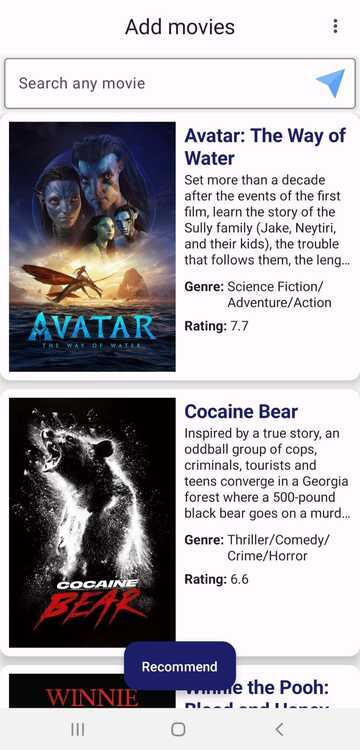
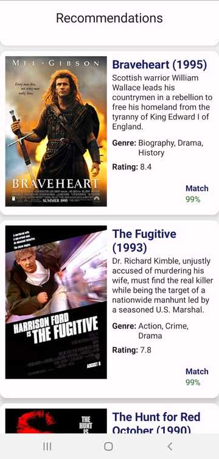

# Movie Recommendation
An Android application to make Movie recommendations based on user's selections of likable movies. 

## Features 
- User can select movies from the recent/trending movies list or search specific movies/series from search bar.
- Select movies and add it to the favourite list (maximum = 10)
- Press the "recommend" button to suggest movies based on user selected movie's features. 

## Screenshots
 

## Functioning
- Developed using Kotlin as base language and Compose library (Material3) for UI
- Currently using Google Tensor provided already trained CNN (Convolutional neural network encoder) model to provide recommendation. It is based on context encoding. 
- The application is also linked with Google Firebase analytics and Big Query which will be used to process the analytics data and obtain training data. Currently, the app is still waiting on sufficient data following which I will use Firebase model management and ML API to create a personalised TF lite model.
- Once the TF lite model is downloaded in our app (currently using Google provided), we need to provide the input array with IDs (and other movie features such as genre) and then obtain the output via TensorFlow tflite model.

## Frameworks and Libraries used - 
- [Google TensorFlow](https://www.tensorflow.org/lite/android)
- [Retrofit with Rxjava2](https://square.github.io/retrofit/) 
- [Jetpack Compose (Material3)](https://developer.android.com/jetpack/compose/designsystems/material3)
- [Gson](https://github.com/google/gson)
- [Glide](https://github.com/bumptech/glide)
- [TMdb](https://developer.themoviedb.org/reference/intro/getting-started) (movie database API for populating initial screen with recent/popular movies)
- [OMdb](https://www.omdbapi.com) (movie database to search movies)
